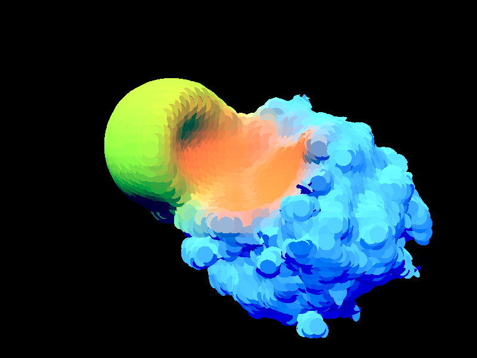
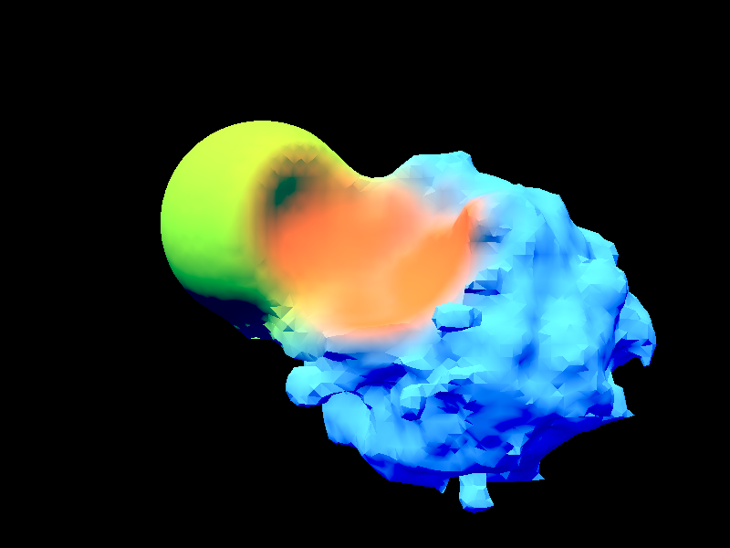

# Gutter

> *We are all in the gutter, but some of us are looking at the stars.*
>
> &mdash; Oscar Wilde



Behold my exploration of surface splatting in LÖVE.
The surface disks are drawn as indexed triangle pairs.
A pixel shader discards any pixel outside of the disk.


## Dual contouring

As an alternative to surface splatting, you can generate a regular triangle mesh using dual contouring:

```sh
love . --mesher dual-contouring
```


