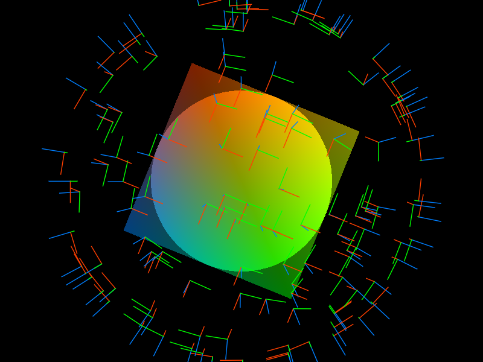

# Gutter

> *We are all in the gutter, but some of us are looking at the stars.*
>
> &mdash; Oscar Wilde

> *Do not mistake me for a star  
> Though I'll shine like them at night  
> But behold instead the darkness in between them  
> The Devil's light*
>
> &mdash; Watain

Behold my exploration of surface splatting in LÖVE.
The surface disks are drawn as indexed triangle pairs.
A pixel shader discards any pixel outside of the disk.
