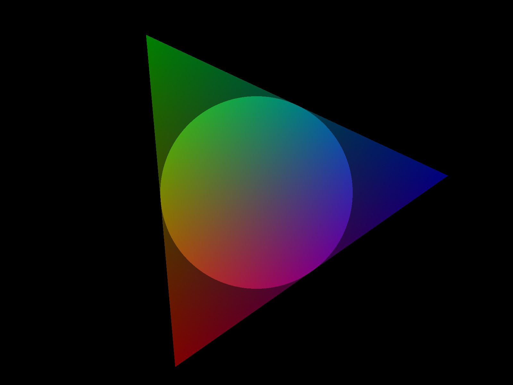

# Splatter

In this demo, I will explore point splatting in LÖVE. Since LÖVE doesn't have geometry shaders, splats are initially represented by equilateral triangles that imply inscribed unit circles. The texture coordinates of the triangle vertices represent offset from the shared centroid of the triangle and the circle. The pixel shader can then discard pixels that are outside of the circle. You can apply an arbitrary transform to the triangle, distorting the circle into an ellipse.
