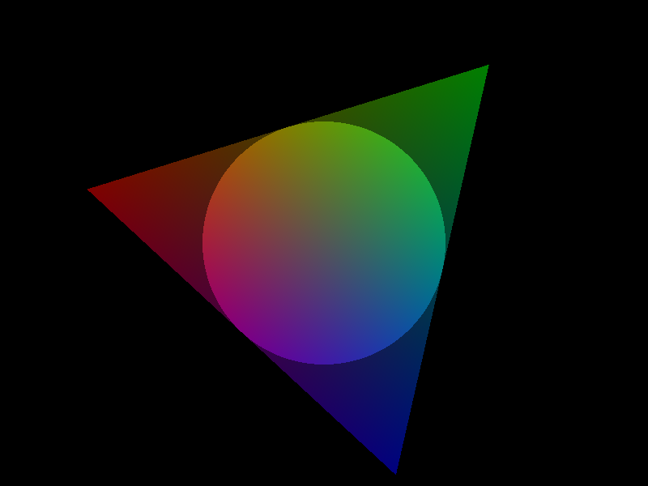

# Gutter

> *We are all in the gutter, but some of us are looking at the stars.*
>
> &mdash; Oscar Wilde

> *Do not mistake me for a star  
> Though I'll shine like them at night  
> But behold instead the darkness in between them  
> The Devil's light*
>
> &mdash; Watain

In this demo, I will explore point splatting in LÖVE. Since LÖVE 11.3 doesn't support geometry shaders, splats are represented by equilateral triangles with inscribed unit circles. The texture coordinates of each triangle vertex represent an offset from the centroid. The pixel shader uses the interpolated texture coordinates to discard pixels that are outside of the circle. You can apply an arbitrary transform to the triangle, distorting the circle into an ellipse.
